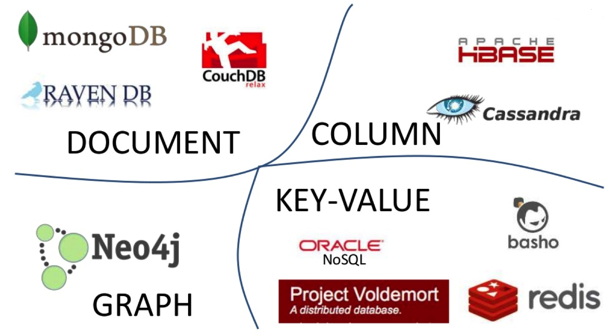
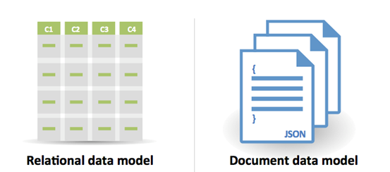
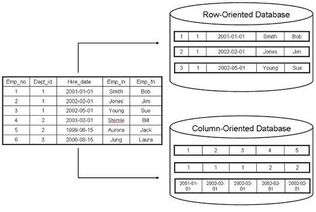

# Base de datos

## ¿Qué es una base de datos?
* Una base de datos es una colección de datos organizados según un determinado criterio
* Estos datos se pueden leer, crear, actualizar y borrar
* También existen motores de base de datos que nos permiten hacer todas estas operaciones de forma más fácil

### Tipos de base de datos
* Existen distintos tipos de bases de datos que se utilizan para solucionar distintos tipos de problemas
* Dentro de la gran familias de bases de datos podemos encontrar las del tipo base de datos relacionales y las no relacionales
* Las bases de datos relacionales se conocen generalmente como las SQL
* Las no relacionales se conocen como NoSQL
* Cada tipo de base de datos tiene beneficios y contras a la hora de almacenar, leer, actualizar o borar los datos

### Bases de datos relacional
> La base de datos relacional (BDR) es un tipo de base de datos (BD) que cumple con el modelo relacional

* Desde su definición vemos que una base de datos puede ser [relacional](https://es.wikipedia.org/wiki/Base_de_datos_relacional) si cumple con algo conocido como el [modelo relacional](https://es.wikipedia.org/wiki/Modelo_relacional)

> El modelo relacional es un modelo de datos basado en la lógica de predicados y en la teoría de conjuntos. Su idea fundamental es el uso de relaciones. Estas relaciones podrían considerarse en forma lógica como conjuntos de datos llamados tuplas. Pensamos cada relación como si fuese una tabla que está compuesta por registros (cada fila de la tabla sería un registro o "tupla") y columnas (también llamadas "campos").

* En la definición de modelo relacional nos podemos quedar con la idea de tablas que tienen columnas para describir los datos que están relacionados entre si.
#### Ejemplo modelo relacional:


* Para que sea modelo relacional debe cumplir con los [siguientes requisitos](https://es.wikipedia.org/wiki/12_reglas_de_Codd)
* Entre los motores de bases de datos relacionales más conocidas encontramos a [SQL Server](https://www.microsoft.com/es-es/sql-server/sql-server-2016), [MySQL](https://www.mysql.com/) y [PostgreSQL](https://www.postgresql.org/) entre otras
* Estos motores de base de datos soporta el [lenguaje SQL](https://es.wikipedia.org/wiki/SQL) (Structured Query Language) para realizar consultas
* Este modelo de datos es el más utilizado en la actualidad
* Para completar nuestra formación como profesionales está muy bueno incorporar conocimientos sobre este tipo de bases de datos
* Uno de los grandes beneficios que tiene este tipo de motores de base de datos es poder realizar [operaciones atómicas](https://es.wikipedia.org/wiki/Atomicidad)
* Evita tener datos repetidos
* Escala de manera vertical
* Para aprender más sobre SQL pueden ingresar a los sitios de:
  * [Fundamentos SQL](http://pedrobeltrancanessa-biblioteca.weebly.com/uploads/1/2/4/0/12405072/fundamentos_de_sql_3edi_oppel.pdf)
  * [Khan Academy (inglés)](https://www.khanacademy.org/computing/computer-programming/sql)
  * [W3 Schools (inglés)](https://www.w3schools.com/sql/)

### Modelo NoSQL
* Se conoce como [NoSQL (Not Only SQL)](https://es.wikipedia.org/wiki/NoSQL) al grupo de bases de datos que no son relacionales
* Dentro de esta clasificación se encuentran las bases de clave/valor, orientadas a documentos, grafos, de grandes columnas

* Este tipo de bases de datos escala de forma horizontal
* Podemos utilizar muchas máquinas chiquitas para crecer y satisfacer las necesidades de los negocios actuales


#### Clave/valor
* Las bases de datos de `clave/valor` guardan valores en formato de diccionario o hash utilizando una clave como índice y su valor. 


#### Orientadas a documentos
* Las base de datos `orientadas a documentos` es bastante parecída a las de `clave/valor`.
* La diferencia recide principalmente en en la complejidad del modelo de dato
* Clave/valor tiene un modelo de lo más simple


* Documento puede tener un modelo de documento complejo
* Muchos de estos motores utilizan JSON/BSON para guardar los datos

* Entre los motores más conocidos de este tipo se encuentra MongoDB

#### Grafos
* Estas bases de datos utilizan el modelo de Grafos
* Se especializan en relaciones
* Las podemos utilizar por ejemplo para guardar puntos de un camino, relaciones de amigos, familia, o cualquier tipo de dato que represente alguna relación
* Entre los motores más conocidos de este tipo se encuentra Neo4j


#### Grandes columnas/BigTable
* Este tipo de familia de bases de datos está orientada a grandes cantidades de datos
* Lo datos son almacenados en columnas
* En una columna tiene múltiples datos
* Entre los motores más conocidos de este tipo se encuentra Cassandra o HBase


* Podemos informarnos más sobre las diferencias entre SQL y NoSQL en el [siguiente link](https://blog.pandorafms.org/es/nosql-vs-sql-diferencias-y-cuando-elegir-cada-una/)

## MongoDB
* MongoDB es una base NoSQL orientada a documentos
* Permite guardar documentos en formato de JSON
* Tiene esquema flexible, es decir que podemos cambiar la estructura de nuestros documentos sin ningún problema
* MongoDB está preparado para escalar fácilmente de manera horizontal
* Dado que aprendimos ECMAScript vamos a utilizar un motor de base de datos que nos permite seguir utilizando este lenguaje para guardar nuestros datos

### Instalar MongoDB
* Para instalar MongoDB primero tenemos que descargar el [instalador desde su sitio](https://www.mongodb.com/download-center#community)
* Vamos a elegir la versión de Community Server
* Seleccionamos Windows
* Elegimos la versión Windows Server 2008 R2 64-bits and later, with SSL support x64
* Hacer click en el botón de descargar


* Luego de terminar con la descarga ejecutamos el instalador e instalamos la versión completa de MongoDB siguiendo todos los pasos que nos pide
* El instalador instala MongoDB en la siguiente ruta `C:\Program Files\MongoDB\Server\3.4\.`
* En este caso la versión es `3.4` y la ruta puede cambiar según cambie la versión de MongoDB
* MongoDB no tiene dependencias de otras librerías por lo cual se puede ejecutar tanto desde la carpeta donde está instalado como desde cualquier otro lado del sistema operativo

### Configurar el ambiente de MongoDB
* MongoDB necesita que le configuremos un directorio donde guardar todos los datos
* Por defecto MongoDB utiliza la carpeta `\data\db` de donde se levanta el servidor
* Vamos a crear esta carpeta para configurar los datos

```bash
C:\> md \data\db
```

* Al levantar el servidor se puede especificar un parámetro llamado `--dbpath` con la ruta absoluta a donde queremos almacenar los datos

```bash
"C:\Program Files\MongoDB\Server\3.4\bin\mongod.exe" --dbpath d:\test\mongodb\data
```

* Para poder acceder a los comandos de MongoDB desde cualquier lado tenemos que configurar una variable de entorno en el sistema operativo

#### Windows 10 y Windows 8
* En Buscar, busque y seleccione: Sistema (Panel de control)
* Haga clic en el enlace Configuración avanzada del sistema.
* Haga clic en Variables de entorno. En la sección Variables del sistema, busque la variable de entorno PATH y selecciónela. Haga clic en Editar. Si no existe la variable de entorno PATH, haga clic en Nuevo.
* En la ventana Editar la variable del sistema (o Nueva variable del sistema), debe especificar el valor de la variable de entorno PATH. Haga clic en Aceptar. Cierre todas las demás ventanas haciendo clic en Aceptar.

#### Windows 7
* Desde el escritorio, haga clic con el botón derecho del mouse en el icono de la computadora.
* Seleccione Propiedades en el menú contextual.
* Haga clic en el enlace Configuración avanzada del sistema.
* Haga clic en Variables de entorno. En la sección Variables del sistema, busque la * variable de entorno PATH y selecciónela. Haga clic en Editar. Si no existe la variable de entorno PATH, haga clic en Nuevo.
* En la ventana Editar la variable del sistema (o Nueva variable del sistema), debe especificar el valor de la variable de entorno PATH. Haga clic en Aceptar. Cierre todas las demás ventanas haciendo clic en Aceptar.

* Ahora ya podemos agregar la nueva ruta de MongoDB a la configuración del PATH
* Tener en cuenta que los datos en PATH se separan utilizando un `;`
* Copiar y agregar la dirección completa a la carpeta `bin` que está dentro del directorio donde se instaló MongoDB

```bash
C:\Program Files\MongoDB\Server\3.4\bin
```

* Gracias a esta configuración ahora podemos ejecutar MongoDB utilizando sus comandos sin tener que escribir la ruta absoluta al directorio donde esta instalado
* Para saber más sobre las variables de entorno pueden leer el [siguiente documento](https://es.wikipedia.org/wiki/Variable_de_entorno)

* En cada guía encontramos los pasos a seguir para instalar MongoDB en los distintos sistemas operativos
  * [Mac](https://docs.mongodb.com/manual/tutorial/install-mongodb-on-os-x/)
  * [Linux](https://docs.mongodb.com/manual/tutorial/install-mongodb-on-linux/)


### Levantar una instancia de mongod
* Para levantar el servidor de MongoDB tenemos que correr el siguiente script según nuestro sistema operativo
* En windows:
```bash
mongod.exe
```
* En Mac/Linux:
```bash
mongod.exe
```

* Al levantar el server nos da información sobre la configuración de esta instancia
* Nos informa el lugar donde guarda los datos `/data/db`
* El tipo de motor que utiliza que en este caso se llama `wiredTiger`
* Y también el purto donde está corriendo MongoDB que por defecto es `27017`

```bash
[initandlisten] Detected data files in /data/db created by the 'wiredTiger' storage engine, so setting the active storage engine to 'wiredTiger'
I NETWORK  [thread1] waiting for connections on port 27017
```

### Presentar el shell
* Para poder interactuar con el servidor tenemos que iniciar un `cliente/shell` de MongoDB 
* Ejecutamos el siguiente comando según el sistema operativo:

* Para Windows:
```bash
mongo.exe
```
* En Mac/Linux:
```bash
mongo
```

* Al conectarnos vemos una descripción similar a la siguiente:

```bash
MongoDB shell version v3.4.2
connecting to: mongodb://127.0.0.1:27017
MongoDB server version: 3.4.2
>
```

* El cliente nos informa que se está conectando al servidor que está en `mongodb://127.0.0.1:27017`
* También nos muestra las versiones del cliente y servidor (`v3.4.2`)
* Para poder utilizar MongoDB tenemos que tener levantado el servidor por un lado y si queremos hacer consultas o ver los datos podemos levantar el cliente
* Este cliente de MongoDB es una consola de JavaScript por lo cual podemos ejecutar código de la siguiente forma

```bash
> 2 + 2
4
```

* Al conectarnos al cliente de MongoDB accedemos por default a la base llamada `test`
* Para saber en que base estamos podemos tipear `db`

```bash
> db
test
>
```

* Para ver todas las bases que tenemos podemos ejecutar `show databases` o `show dbs`

```bash
> show databases

show databases
test        0.000GB
``` 

```bash
> show dbs
```

* Es posible que sólo tengamos la base `test` ya que recién instalamos el servidor
* MongoDB crea las tablas de forma 


### Crear un documento

### Buscar un documento

### Manejo básico de documentos (CRUD)


## Integración con Node.js

### Driver MongoDB

### Crear una conección entre MongoDB y Node.js

### Obtener datos desde MongoDB usando Node.js

### Crear datos desde Node.js

### Ejemplo de CRUD usando todo lo aprendido

